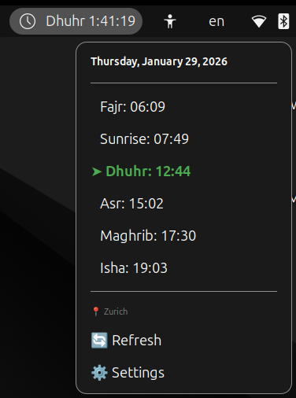

# Prayer Times - GNOME Shell Extension

A GNOME Shell extension that displays Islamic prayer times in the top panel with countdown timer, notifications, and Turkish (Diyanet) calculation method support.


## Features

- 🕌 **Panel Indicator**: Shows the next prayer name and countdown timer in the top bar
- 📋 **Popup Menu**: Click to see all prayer times for the day
- 📍 **Auto Location**: Detects your location via IP geolocation
- 🗺️ **Manual Location**: Set custom latitude/longitude coordinates
- 🔔 **Notifications**: Get notified exactly when prayer time starts
- ⏰ **Reminders**: Pre-alert notification X minutes before prayer time
- 🇹🇷 **Diyanet Method**: Default calculation method from Turkish Presidency of Religious Affairs
- 💾 **Offline Cache**: Works offline with cached prayer times
- 🌍 **Multiple Methods**: Support for 15+ calculation methods worldwide

## Screenshots



## Requirements

- GNOME Shell 45 or later
- GLib and GTK4 development libraries (for schema compilation)

## Installation

### Method 1: Using the Install Script (Recommended)

```bash
cd /path/to/AzanExtension
chmod +x install.sh
./install.sh
```

### Method 2: Manual Installation

1. **Compile the GSettings schema:**

```bash
cd /path/to/AzanExtension
glib-compile-schemas schemas/
```

2. **Copy the extension to GNOME extensions directory:**

```bash
mkdir -p ~/.local/share/gnome-shell/extensions/prayertimestr@emre.dev
cp -r metadata.json extension.js prefs.js stylesheet.css schemas ~/.local/share/gnome-shell/extensions/prayertimestr@emre.dev/
```

3. **Restart GNOME Shell:**
   - **X11**: Press `Alt+F2`, type `r`, and press Enter
   - **Wayland**: Log out and log back in

4. **Enable the extension:**

```bash
gnome-extensions enable prayertimestr@emre.dev
```

## Configuration

Open the extension settings using:

```bash
gnome-extensions prefs prayertimestr@emre.dev
```

Or through GNOME Extensions app / GNOME Tweaks.

### Available Settings

| Setting | Description | Default |
|---------|-------------|---------|
| Automatic Location | Use IP-based geolocation | Enabled |
| Latitude | Manual latitude coordinate | 41.0082 (Istanbul) |
| Longitude | Manual longitude coordinate | 28.9784 (Istanbul) |
| Calculation Method | Prayer time calculation algorithm | Diyanet (Turkey) |
| Enable Notifications | Show notifications at prayer times | Enabled |
| Enable Reminders | Show pre-prayer reminders | Enabled |
| Reminder Time | Minutes before prayer for reminder | 30 |

### Calculation Methods

The extension supports the following calculation methods:

- **Diyanet İşleri Başkanlığı** (Turkey) - Default
- Muslim World League
- Islamic Society of North America (ISNA)
- Umm Al-Qura University, Makkah
- Egyptian General Authority of Survey
- University of Islamic Sciences, Karachi
- And many more...

## File Structure

```
AzanExtension/
├── metadata.json          # Extension metadata
├── extension.js           # Main extension code
├── prefs.js              # Settings preferences UI
├── stylesheet.css         # Custom styles
├── install.sh            # Installation script
├── README.md             # This file
└── schemas/
    └── org.gnome.shell.extensions.prayertimestr.gschema.xml
```

## Data Source

Prayer times are fetched from the [Aladhan API](https://aladhan.com/prayer-times-api), which provides accurate prayer times based on various calculation methods.

## Troubleshooting

### Extension not showing up

1. Make sure the schema is compiled:
   ```bash
   glib-compile-schemas ~/.local/share/gnome-shell/extensions/prayertimestr@emre.dev/schemas/
   ```

2. Check for errors in the log:
   ```bash
   journalctl -f -o cat /usr/bin/gnome-shell
   ```

### Prayer times not loading

1. Check your internet connection
2. The extension will use cached data if available
3. Try clicking the Refresh button in the popup menu

### Location not detected

1. If automatic location fails, manually set latitude/longitude in settings
2. You can find your coordinates on [Google Maps](https://maps.google.com)

## Uninstall

```bash
rm -rf ~/.local/share/gnome-shell/extensions/prayertimestr@emre.dev
```

Then restart GNOME Shell.

## License

This extension is released under the GNU General Public License v3.0.

## Credits

- Prayer times data: [Aladhan.com API](https://aladhan.com/)
- IP Geolocation: [IP-API.com](http://ip-api.com/)

## Contributing

Contributions are welcome! Please feel free to submit a Pull Request.
